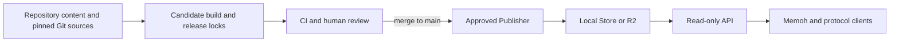

# Supermarket

Official Plugin & Skill Registry for [Memoh](https://github.com/memohai/Memoh).

## Project Structure

```text
supermarket/
├── registries/
│   ├── memoh/
│   │   ├── registry.yaml            # Repository-owned Registry definition
│   │   ├── release.lock.json        # Approved Snapshot revision
│   │   ├── plugins/<plugin-id>/     # Plugin source plus approved release.lock.json
│   │   └── packages/<package-id>/skills/<skill-id>/
│   │                                   # Repository-owned Skill sources
│   └── openai/
│       ├── registry.yaml            # External Registry definition
│       └── release.lock.json        # Approved Snapshot revision
├── lib/archive.ts                   # Shared safe TAR/Gzip primitives
├── plugin/                          # Plugin manifest parsing and repository validation
├── registry/                        # Registry model, sources, adapters, publishing, and storage
├── server/                          # Nitro API routes and HTTP-facing services
├── scripts/registry/                # Validation, update checking, and publishing commands
├── workers/api/wrangler.jsonc       # Read-only API Worker environments and R2 bindings
├── .github/workflows/               # CI, candidate update PRs, and approved publication
├── client/                          # Reference Registry client and safe extractor
├── nitro.config.mjs
└── vite.config.ts
```

Registry Skills and Plugins are published into `.data/registries` locally or R2 when deployed; neither Registry Snapshots nor installable content is bundled into the API Worker. A Registry Snapshot stores the complete immutable Package set for one Registry, with each Package containing its Skill descriptors. The API exposes Packages directly and expands their members into the searchable Skill Catalog view. Each Plugin has an immutable release descriptor that binds its Bundle digest and the exact Registry Snapshot and Skill Artifact descriptor for every referenced Skill. Git commits `release.lock.json` files as approval records. Runtime `state.json` objects are the only mutable pointers and select the current approved Snapshot or Plugin release after every referenced immutable object has been stored.

The Codex Marketplace adapter imports only Packages that declare Skills without Apps, MCP servers, hooks, commands, agents, or LSP servers.



## Development

Development requires the Bun version pinned in `.bun-version`. Git and upstream network access are also required when validating or publishing a Git-backed Registry.

```bash
bun install
bun run registry:publish
bun run dev
```

The first publication must publish every enabled Registry so the local Store contains the approved Snapshots needed to resolve Plugin Skill references. Later publications may select one Registry with `bun run registry:publish -- --registry <id>`. The Vite and Nitro development server listens on `http://127.0.0.1:5173` by default and reads `.data/registries`. Set `REGISTRY_DATA_DIR` to use a different local Store.

| Command | Purpose |
|---------|---------|
| `bun test` | Run the Bun test suite |
| `bun run typecheck` | Generate Worker types and check server and Vue projects |
| `bun run build` | Validate approved releases and build the Cloudflare Worker |
| `bun run registry:lock -- --registry <id>` | Rebuild one Registry lock and all affected Plugin locks |
| `bun run registry:lock -- --plugin <id>` | Rebuild one Plugin lock |
| `bun run registry:validate` | Rebuild every enabled source and verify committed locks |
| `bun run registry:publish` | Publish approved releases to the local Store |
| `bun run registry:updates` | Check configured upstream tracking refs |
| `bun run registry:client -- <command>` | Run the reference discovery and installation client |

### Reference Client

The client defaults to `http://127.0.0.1:5173`. Override it with `--base` or `SUPERMARKET_URL`.

```bash
bun run registry:client -- list
bun run registry:client -- search gmail --registry memoh
bun run registry:client -- inspect memoh gmail gmail
bun run registry:client -- install memoh gmail gmail \
  --destination /tmp/supermarket-skills
```

## API

Base URL: `https://supermarket.memoh.ai`

| Method | Path | Description |
|--------|------|-------------|
| GET | `/api/plugins` | List Plugins. Query: `q`, `tag`, `page`, `limit` |
| GET | `/api/plugins/:id` | Get Plugin details |
| GET | `/api/plugins/:id/releases/:revision` | Get an immutable Plugin release descriptor |
| GET | `/api/artifacts/plugin/:digest` | Download an immutable Plugin package |
| GET | `/api/packages` | Search Skill Packages. Query: `q`, `registry`, `category`, `tag`, `page`, `limit`, `sort` |
| GET | `/api/skills` | Search enabled Registry Skills. Query: `q`, `registry`, `package`, `category`, `tag`, `page`, `limit`, `sort` |
| GET | `/api/registries` | List Registries and current counts |
| GET | `/api/registries/:registryId` | Get the approved Registry definition, source revision, and diagnostics |
| GET | `/api/registries/:registryId/categories` | List categories in one Registry |
| GET | `/api/registries/:registryId/packages` | Search Packages in one Registry |
| GET | `/api/registries/:registryId/packages/:packageId` | Get the current Package descriptor |
| GET | `/api/registries/:registryId/packages/:packageId/releases/:revision` | Get an immutable Package descriptor |
| GET | `/api/registries/:registryId/skills` | Search Skills in one Registry |
| GET | `/api/registries/:registryId/packages/:packageId/skills/:skillId` | Get one Registry Skill |
| GET | `/api/artifacts/skill/:digest` | Download a Skill archive |
| GET | `/api/artifacts/icon/:digest` | Download a Skill icon |

Packages are derived from one immutable Registry Snapshot and group all Skills with the same `(registry_id, package_id)`. A Package descriptor pins its Snapshot revision and every member Skill Artifact digest; it does not create a combined archive. Registry Skills use the identity `(registry_id, package_id, skill_id)`. The reference client installs them into `<registry_id>+<package_id>+<skill_id>`.
Plugin source manifests use those identities as references. A published Plugin release resolves each reference to a fixed Registry Snapshot revision and Skill Artifact digest, so installing the same Plugin release always installs the same Skill content.
The installation identity is supplied by the client rather than embedded as an archive directory; the archive itself contains the Skill files at its root.
## Contributing

### Adding a Plugin

1. Create a directory under `registries/memoh/plugins/` named after your plugin (for example, `registries/memoh/plugins/notion/`).
2. Add a `plugin.yaml` manifest:

```yaml
schema_version: "1"
id: notion
name: Notion
version: "0.1.0"
description: Use Notion pages, databases, and search from Memoh.
author:
  name: Memoh
  email: support@memoh.ai
icon:
  kind: builtin
  name: notion
homepage: https://example.com
tags:
  - productivity
capabilities:
  - search_pages
install:
  - sh scripts/install.sh
auth_requirements:
  - key: notion_oauth
    type: managed_oauth
    client_ref: notion
    scopes: []
mcps:
  - key: notion
    name: Notion
    transport: stdio
    command: npx
    args: ["-y", "@notionhq/notion-mcp-server"]
    auth_ref: notion_oauth
    visibility: hidden
skills: []
```

Plugin Skills are Registry references, not embedded files:

```yaml
skills:
  - registry_id: memoh
    package_id: notion
    skill_id: notion-meeting-intelligence
```

3. Optionally add `hooks.json` and `scripts/**`. Plugin download archives include those allowed files and `plugin.yaml`. Skill content must be published by a Registry; `registry:validate` rejects bundled `plugins/<id>/skills/**` content and missing references.
4. Generate and review the Plugin release lock:

```bash
bun run registry:lock -- --plugin notion
bun run registry:validate
```

Commit `release.lock.json` with the Plugin source. It locks the canonical release descriptor, including the Plugin Bundle digest and every resolved Skill digest. Changing Plugin files or approved Skill dependencies without updating this lock makes CI fail.

### Adding a Skill

1. Create `registries/memoh/packages/<package-id>/skills/<skill-id>/SKILL.md` with YAML frontmatter. For an independent Skill, use the Skill ID as both the package and Skill ID:

```markdown
---
name: my-skill
description: What this Skill does and when to use it.
metadata:
  author:
    name: Your Name
    email: you@example.com
  tags: [example]
  category: productivity
  homepage: https://example.com
---

# My Skill

Instructions and documentation go here.
```

2. Regenerate the approved Snapshot lock, then validate and publish it locally:

```bash
bun run registry:lock -- --registry memoh
bun run registry:validate
bun run registry:publish -- --registry memoh
bun run dev
```

On a new checkout, run the full `bun run registry:publish` once before using partial publication. Commit the Registry `release.lock.json` and any changed `plugins/*/release.lock.json` files with the Skill source. `registry:lock -- --registry <id>` rebuilds Plugin locks because a changed Skill may produce a new Plugin release.

Skill archives include regular files under the Skill root, including binary assets; `.git` and `node_modules` directories are ignored. An archive is limited to 1,000 files, 5 MiB of regular-file content, 5 MiB of serialized TAR data, and 6 MiB compressed. Every Artifact descriptor includes the immutable digest, compressed `size`, regular-file `uncompressed_size`, serialized `archive_size`, and `file_count`; clients must reject descriptors that omit those extraction fields. A Plugin release may reference at most 128 Skills, with aggregate limits of 128 MiB each for compressed bytes, regular-file body bytes, and serialized TAR bytes, plus 10,000 files.

### Adding a Registry

Create `registries/<registry-id>/registry.yaml`:

```yaml
schema_version: "1"
id: example
name: Example
enabled: true
priority: 100
adapter:
  type: skill_directory
source:
  type: git
  url: https://github.com/example/skills.git
  revision: 0123456789abcdef0123456789abcdef01234567
  tracking_ref: main
```

Generate its initial release lock and validate it:

```bash
bun run registry:lock -- --registry example
bun run registry:validate
```

#### Sources and Adapters

Supported sources are `local` and HTTPS `git`; adapters are `skill_directory`, `skill_package_directory`, and `codex_marketplace_skills`. `skill_package_directory` reads `<package-id>/skills/<skill-id>` from its source root. A local source path is relative to the directory containing its `registry.yaml`. A Git source must pin an exact commit in `revision`; optional `tracking_ref` opts it into upstream update checks.

`codex_marketplace_skills` reads `catalog_path` from its source root and supports only Marketplace Packages whose source is a local path in that same checkout. Each Package must contain `.codex-plugin/plugin.json` and declare one or more Skill paths. The Adapter imports only declared Skills; other Package components such as `apps`, `mcpServers`, and `hooks` are outside the Skill Catalog. Packages with no Skills, another source type, or invalid Skill content are skipped with explicit Registry diagnostics. An invalid Package is isolated so other valid Packages in the same Registry can still be published.

Git sources use a filtered shallow fetch and root-anchored sparse checkout for the Adapter paths. Adapter reads enforce Registry-wide limits of 10,000 Skills, 100,000 source files, 512 MiB of source file bodies, 64 MiB of retained review text, and an 8 MiB Snapshot. Registry-producing commands build Registries sequentially, so those per-build bounds do not multiply with Registry count. Every enabled Registry must commit `release.lock.json`, whose `snapshot_revision` must equal the canonical Snapshot rebuilt from the approved source.

## Registry Updates

The scheduled `Check Registry updates` workflow runs every 12 hours and keeps at most one open review PR for each changed Registry. If the upstream revision or `main` base changes before merge, the workflow rebuilds the candidate, updates that PR with `--force-with-lease`, replaces its report, and reruns CI. Branch protection must dismiss stale approvals when new commits are pushed. A closed PR is not recreated for the same upstream revision. The PR and Actions Summary include concrete errors for skipped Packages. Merging the PR approves the updated Registry and affected Plugin locks. A manual run can optionally select one Registry.

If publisher, Adapter, or archive code intentionally changes the generated Snapshot without changing the pinned upstream commit, regenerate the lock with `bun run registry:lock -- --registry <id>` and review its revision change in the same PR.

## Deployment

After an approved change reaches `main`, the `Publish approved Registries` workflow validates and publishes the approved Registry and Plugin releases to R2. The API Worker remains read-only.

Test and production bucket names have a single source of truth: the matching environments in `workers/api/wrangler.jsonc`. Before the first deployment, authenticate Wrangler, enable R2, and create those buckets:

```bash
bunx wrangler whoami
bunx wrangler r2 bucket create test-memoh-supermarket
bunx wrangler r2 bucket create memoh-supermarket
```

Bucket creation is a one-time operation; use `bunx wrangler r2 bucket list` to check whether they already exist. Configure GitHub environments named `test` and `production`, each with bucket-scoped `R2_ACCESS_KEY_ID` and `R2_SECRET_ACCESS_KEY` secrets, plus `CLOUDFLARE_ACCOUNT_ID`. Protect the `production` environment if publication should require an additional approval.

Deploy the read-only API Worker with:

```bash
# Test
bun run registry:api:deploy:test

# Production
bun run registry:api:deploy:production
```

Use the `Publish approved Registries` workflow with the `test` environment to test publication without touching production. For a local build, `bun run registry:publish` writes to `.data/registries`, or to `REGISTRY_DATA_DIR` when configured.

## License

[Apache-2.0](LICENSE)

---

Built with [Nitro](https://nitro.build) and [Cloudflare Workers](https://workers.cloudflare.com).
